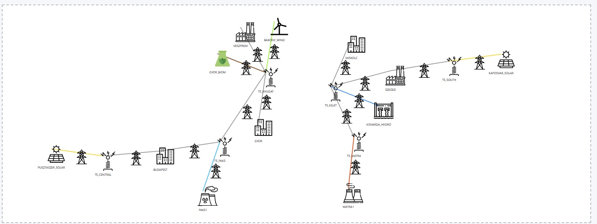

# ⚡ PowerGrid Simulator

Ez a projekt egy egyszerű villamosenergia-hálózat szimulátor C++ nyelven, amely modellezi az erőműveket, transzformátorokat és fogyasztókat, és képes azok kapcsolatainak grafikus megjelenítésére webes felületen.

## 🔍 Program Futása

Az alábbi kép mutatja a hálózat vizualizációját futás közben:



## ✨ Főbb funkciók

- PowerPlant, TransformerStation, UserEndpoint típusú csomópontok
- Élek paraméterekkel (hossz, veszteség, kapacitás)
- JSON export
- SVG-alapú topológiai vizualizáció

## 🛠️ Követelmények

- C++17 vagy újabb
- CMake vagy Make
- Webes vizualizációhoz:
  - Böngésző
  - JavaScript támogatás

## 🔧 Fordítás (CMake példával)

```bash
mkdir build
cd build
cmake ..
make
./powergrid-simulator
